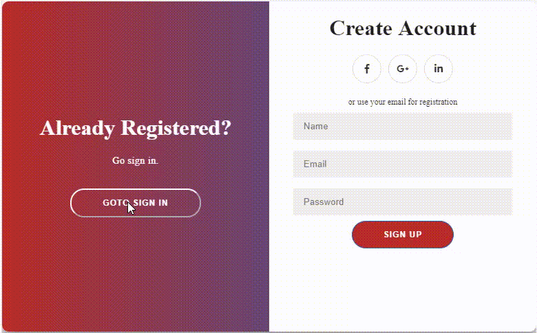

# Chi Chi Ng
## Fancy pants UI components for Angular

[chichi - frilly or elaborate ornamentation](https://www.merriam-webster.com/dictionary/chichi)  

## bypass panel

Like a closet with bypass doors where a panel (door) can be slid back and forth to show content behind. The panels also have content and buttons for sliding them.

I didn't concieve of this design, I watched a [video](https://www.youtube.com/watch?v=mUdo6w87rh4) by Traversy Media that put this together based on the article [DOUBLE SLIDER - SIGN IN/UP FORM](https://www.florin-pop.com/blog/2019/03/double-slider-sign-in-up-form/) by Florin Pop who was inspired by the [Diprella Login](https://dribbble.com/shots/5311359-Diprella-Login) posted by Selecto on dribbble. I took the basic concept and created an Angular component that generalized the sliding panel.



[Gif by OnlineConverter.com](https://www.onlineconverter.com/mp4-to-gif)
### Using
*note* this project isn't published to the npm repo so you will need to link it locally.

To use this you must clone the project locally, build, and think link the built version to your local node cache:
```
cd c:\vsprojects\
clone https://github.com/rreganjr/chichi-ng.git
ng build
cd .\dist\chichi-ng\
npm link
```

Link it to the project where you want to use it:
```
cd c:\vsprojects\myproj\
npm link chichi-ng
```
import the module into your app.module.ts

```
...
import { ChichiNgModule } from 'chichi-ng';
...
@NgModule({
  ...
  imports: [
  ...
  ChichiNgModule
...
```
Use the `cc-bypass-panel` component in your own component. create a variable in your component to hold the state of which side the bypass overlay is located, for example:
```
 rightPanelActive: boolean = false;
```
Use the element in your template. You need to have 4 containers with classes `left-panel-content`, `right-panel-content`, `overlay-left-content`, and `overlay-right-content`:
```
<cc-bypass-panel [rightPanelActive]="rightPanelActive">
  <div class="left-panel-content">
      ...
  </div>

   <div class="right-panel-content">
    ...
  </div>

  <div class="overlay-left-content">
  ...
		<button class="ghost" id="signUp" (click)="rightPanelActive=false">Left Panel Active</button>
	</div>

  <div class="overlay-right-content">
    ...
    <button class="ghost" id="signIn" (click)="rightPanelActive=true">Right Panel Active</button>
  </div>

  </cc-bypass-panel>
```
You can style the overlay with css like:
```
:host ::ng-deep .overlay {
  background: #1565C0;
	background: -webkit-linear-gradient(to right, #b92b27, #1565C0);
	background: linear-gradient(to right, #b92b27, #1565C0);
	background-repeat: no-repeat;
	background-size: cover;
	background-position: 0 0;
}
```
